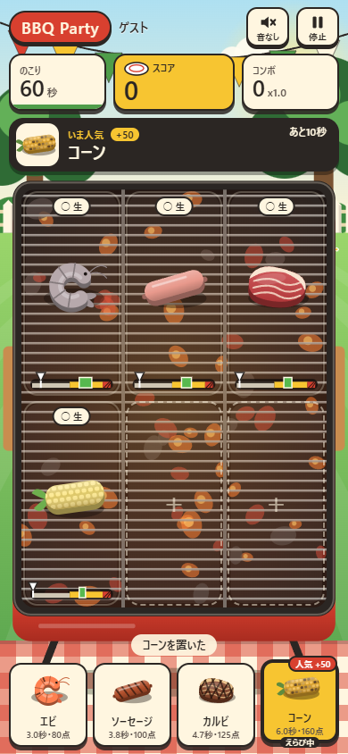
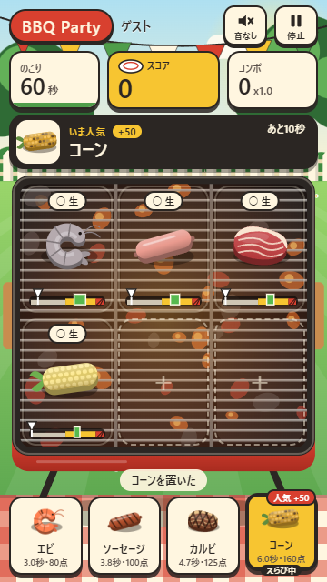
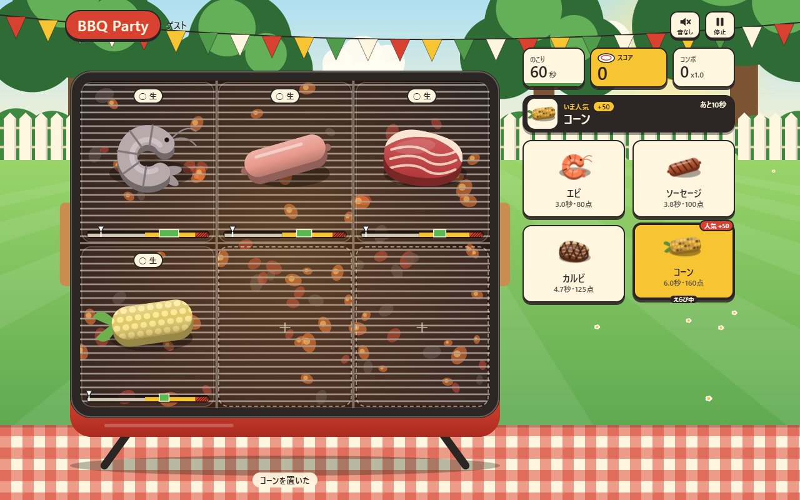

# BBQ Party browser verification

Chrome 153.0.8010.55, real headless browser with a new disposable profile and a loopback HTTP preview. No existing browser profile or foreground desktop UI was used.

- **58 passed, 0 failed** across 390×844, 360×640, and 1280×800 viewports.
- Start/game/result controls fit the viewport; game targets meet 44px minimum sizes.
- Real Canvas raster, ingredient placement/collection, score, pause/resume, retry, and resize exercised.
- Real headless tab switching pauses food/time; returning requires explicit resume.
- WebAudio contexts reach `running` after a trusted click and create oscillators; mute suspends them.
- Web Share payload and clipboard/failure fallback branches exercised with injected API handlers; shared URL contains only version/seed.
- No browser JavaScript exceptions.
- Separate Node core/app tests: **69 passed, 0 failed**.

Cooking/end screenshots use an injected clock offset to avoid waiting a full minute. Layout, DOM, Canvas and event dispatch are real Chrome. API handlers for OS sharing/clipboard are synthetic. Audible speaker output, native OS share sheet, physical phone touch and iOS Safari were not verified; the user can confirm them while playing.

## Screenshots

Screenshots contain only the game and the guest nickname. They contain no user desktop, account data, browser chrome, personal photos or secrets.
